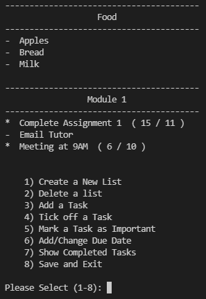
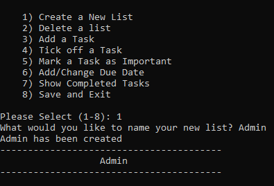
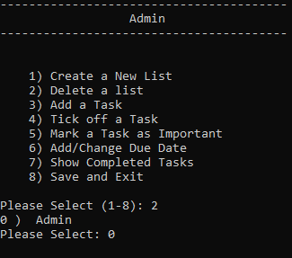
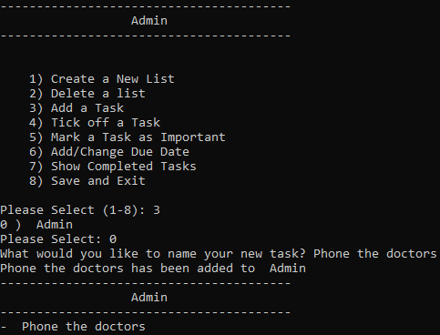
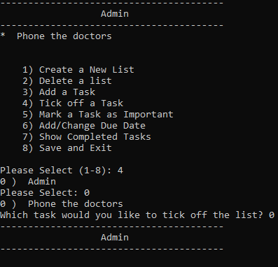
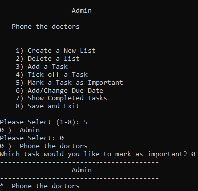
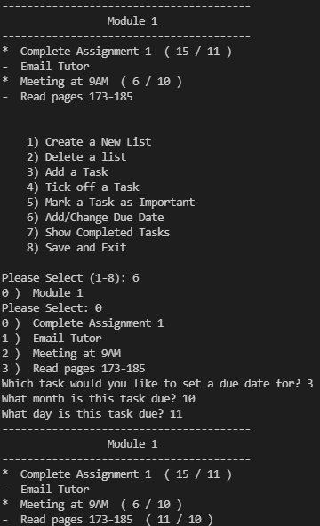
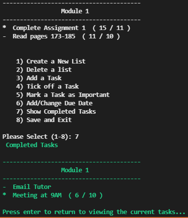
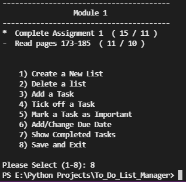

# To-Do List Manager

## Table of Contents

- [Introduction](#introduction)
- [Brief](#brief)
- [Method of Operation](#method-of-operation)
  * [Main Menu](#main-menu)
  * [Create a To-Do List](#create-a-to-do-list)
  * [Delete a To-Do List](#delete-a-to-do-list)
  * [Add a Task](#add-a-task)
  * [Tick off a Task](#tick-off-a-task)
  * [Mark a Task as Important](#mark-a-task-as-important)
  * [Add or Change a Task Due Date](#add-or-change-a-task-due-date)
  * [Show the Completed Tasks](#show-the-completed-tasks)
  * [Save and Exit the Program](#save-and-exit-the-program)
- [Further Work](#further-work)

## Introduction

I have just started my second year of studying computer systems engineering at university. I started this project to learn how to use lists in Python. I have never made a project using Python before so it's a really fun challenge!

## Brief

This project is designed to help my organizational skills. Prior to this project, I either had one large to-do list for all types of tasks (work, personal, study, admin & projects etc.) or I had individual lists on random pieces of paper. This program enables me to keep track of all of my different lists, in one place, with no physical lists to lose or clutter up my desk with. 

## Method of Operation

### Main Menu

	

The main menu shows all of the to-do lists which you have created, with all of their tasks. Important tasks use an "*" bullet point while other tasks just use a "-". Tasks with a deadline are followed by the date of the deadline in the format (dd/mm).

After the to-do list printout, all of the options are shown and you are prompted to select an option. Typing the number for the option which you wish to select, and pressing enter will choose that option.

### Create a To-Do List

	

Select option 1 on the main menu then type the name for your new list and it will be created.

### Delete a To-Do List

	

Select option 2 on the main menu and select which list you want to delete.

### Add a Task

	

Select option 3 on the main menu, select which list you want to add to and enter the name of your new task. 

### Tick off a Task

	

Select option 4 on the main menu, select the list and then select the task. This will remove the task from the list and add it to the list of completed tasks.

### Mark a Task as Important

	

Select option 5 on the main menu, select the list and then select the task. This will mark the task as important and it will now be displayed with a "*" icon.

### Add or Change a Task Due Date

	

Select option 6 on the main menu, select the list and then select the task. Next, type in the month which the task is due, followed by the day which it is due. The task will now be displayed with the due date next to it.

### Show the Completed Tasks

	

Select option 7 on the main menu. This will display all of the tasks which you have completed (tasks from deleted lists will not be shown). Press the enter key to return to the main menu.

### Save and Exit the Program

	

Select option 8 on the main menu. This will save all of your to-do lists and exit the program.

## Further Work

In the future I plan to add the following features;

- Colour coding
- Sorting tasks by importance
- Sorting tasks by due date
- Clearing the completed task history
- Marking a task as not important
- Creating a full GUI application
